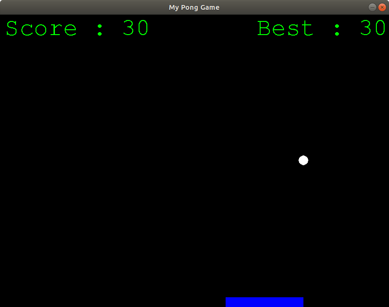

# Python Single Player Pong

## Objectif

Notre objectif est développer une version Python de ce jeu en s'appuyant sur les concepts de programmation que nous avons appris jusqu'à maintenant :

* Utilisation de modules
* les fonctions
* les dictionnaires
* les tests conditionnels
* les boucles

Notre jeu se limitera un un joueur unique. Cette version du jeu est connue sous le nom *_Pong Survivor_* ou *_Single Player Pong_*

Le développement du jeu est basé sur l'utilisation de la bibliothèque *Pygame*

## Activité

[Page de l'activité](http://silanus.fr/nsi/premiere/pong/pong.html)
